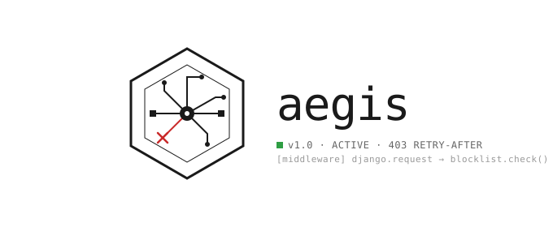

# Aegis

Django middleware that blocks requests from IPs listed in a database-backed blocklist and optional cache-backed rate limiting. Returns styled 403/429 responses with a `Retry-After` header and tracks every blocked attempt.

## Features

- **IP Blocking** — database-backed blocklist with per-entry expiry
- **Rate Limiting** — cache-backed sliding-window rate limiter
- **Auto-Blocking** — rate limit offenders can be automatically added to the blocklist
- Atomic tally and `last_seen` tracking on each hit
- Standards-compliant `Retry-After` header
- Human-readable retry duration in rendered templates
- Skip paths config (e.g., exempt admin/static from rate limiting)

## Installation

Add the middlewares to `MIDDLEWARE` in `settings.py`. `BlockedIPMiddleware` should come first so blocked requests short-circuit before auth, sessions, and views:

```python
MIDDLEWARE = [
    "django.middleware.security.SecurityMiddleware",
    "aegis.middleware.BlockedIPMiddleware",
    "aegis.middleware.RateLimitMiddleware",
    # ...
]
```

Rate limiting requires a Django cache backend. Add one if you don't have one already:

```python
CACHES = {
    "default": {
        "BACKEND": "django.core.cache.backends.locmem.LocMemCache",
    }
}
```

Ensure `aegis` is in `INSTALLED_APPS`, then run migrations:

```bash
python manage.py migrate aegis
```

## Requirements

| Component                        | Purpose                                                              |
| -------------------------------- | -------------------------------------------------------------------- |
| `aegis.models.BlockedIP`         | Model with fields: `ip`, `expires_at`, `last_seen`, `tally`          |
| `aegis.utils.get_client_ip`      | Extracts the real client IP from the request                         |
| `aegis.middleware.BlockedIPMiddleware` | Returns 403 for blocked IPs                                    |
| `aegis.middleware.RateLimitMiddleware` | Returns 429 for rate-limited IPs, with optional auto-block     |
| `aegis.rate_limit`               | Cache-backed rate limit engine                                      |
| `aegis/templates/aegis/403.html` | Template for blocked requests; receives `retry_after_human`          |
| `aegis/templates/aegis/429.html` | Template for rate-limited requests; receives `retry_after_human`     |

## How It Works

On every request, each middleware runs in order:

### BlockedIPMiddleware

1. Resolves the client IP via `get_client_ip(request)`.
2. Looks up an active `BlockedIP` record (`expires_at > now`).
3. If none exists, the request proceeds normally.
4. If one exists:
   - Atomically increments `tally` and updates `last_seen` using `F()`.
   - Computes seconds remaining until `expires_at`.
   - Renders `aegis/403.html` with a humanized duration.
   - Returns `403 Forbidden` with a `Retry-After` header.

### RateLimitMiddleware

1. Checks if the request path should be rate limited (respects `AEGIS_RATE_LIMIT_SKIP_PATHS`).
2. Resolves the client IP.
3. Increments a cache-based counter for the current time window.
4. If the count exceeds `AEGIS_RATE_LIMIT_REQUESTS`:
   - Increments a violation counter.
   - Optionally auto-blocks the IP via `BlockedIP` if violations reach `AEGIS_RATE_LIMIT_AUTO_BLOCK_THRESHOLD`.
   - Returns `429 Too Many Requests` with a `Retry-After` header.
5. If within limits, resets violation count on clean windows and allows the request.

## Response Format

### 403 Forbidden

- **Status:** `403 Forbidden`
- **Header:** `Retry-After: <seconds>` — minimum `1`
- **Body:** Rendered HTML from `aegis/403.html`

### 429 Too Many Requests

- **Status:** `429 Too Many Requests`
- **Header:** `Retry-After: <seconds>`
- **Body:** Rendered HTML from `aegis/429.html`

## Humanized Durations

The `_humanize` helper converts seconds into the largest unit that fits, with correct pluralization:

| Range   | Output         |
| ------- | -------------- |
| `< 60s` | `"42 seconds"` |
| `< 60m` | `"7 minutes"`  |
| `< 24h` | `"3 hours"`    |
| `≥ 24h` | `"2 days"`     |

## Configuration

All settings are optional with sensible defaults.

### Rate Limiting

| Setting                               | Default  | Description                                   |
| ------------------------------------- | -------- | --------------------------------------------- |
| `AEGIS_RATE_LIMIT_ENABLED`            | `True`   | Toggle rate limiting on/off                   |
| `AEGIS_RATE_LIMIT_REQUESTS`           | `100`    | Max requests per window                       |
| `AEGIS_RATE_LIMIT_WINDOW`             | `60`     | Time window in seconds                        |
| `AEGIS_RATE_LIMIT_AUTO_BLOCK`         | `True`   | Auto-block IPs that exceed violation threshold |
| `AEGIS_RATE_LIMIT_AUTO_BLOCK_THRESHOLD` | `5`    | Consecutive limited windows before auto-block |
| `AEGIS_RATE_LIMIT_BLOCK_DURATION`     | `3600`   | Block duration in seconds (default 1 hour)    |
| `AEGIS_RATE_LIMIT_SKIP_PATHS`         | `[]`     | Path prefixes to exclude from rate limiting   |

## Adding a Block

Create a `BlockedIP` row anywhere in your code — a signal, management command, admin action, or rate-limit handler:

```python
from datetime import timedelta
from django.utils import timezone
from aegis.models import BlockedIP

BlockedIP.objects.create(
    ip="203.0.113.45",
    expires_at=timezone.now() + timedelta(hours=1),
)
```

The block takes effect on the offender's next request — no restart or cache invalidation needed.

## Running Tests

```bash
pytest
```

Tests are in `aegis/tests/` and cover:

| File                    | What it tests                                        |
| ----------------------- | ---------------------------------------------------- |
| `test_models.py`        | `BlockedIP.is_active` for permanent, future, expired |
| `test_utils.py`         | `get_client_ip` with direct and proxied requests     |
| `test_middleware.py`    | 403 responses, pass-through, tally tracking          |
| `test_rate_limit.py`    | Rate limit counting, window slots, violations,  429 responses, auto-block, skip paths |
